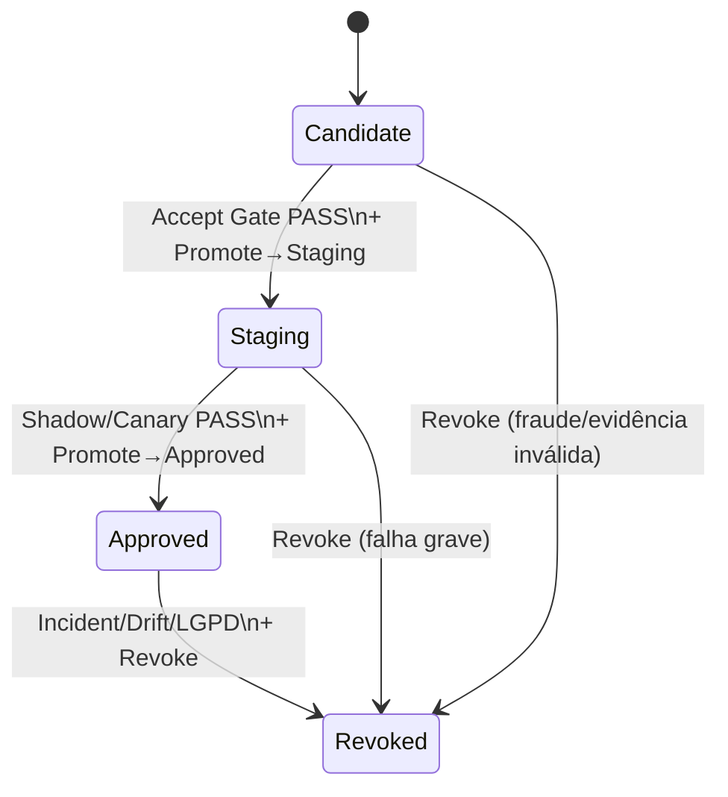

# Z5-2.5 — **Versionamento, Estados & Imutabilidade**

*“modelo só muda de **versão**; versões não mudam.”*

---

## 1) Objetivo & definições

Padronizar **como** um modelo é identificado, **quais estados** de ciclo de vida ele pode assumir no Registry e **quais transições** são permitidas, mantendo **imutabilidade**, **auditabilidade** e **reprodutibilidade** ponta a ponta.

* **Versão** = conteúdo + metadados fixos (**digest**).
* **Estado** = posição no ciclo (ex.: `Candidate`, `Staging`, `Approved`, `Revoked`).
* **Transição** = mudança de estado controlada por **gates** (Policy-as-Code) e **SoD/four-eyes**.

---

## 2) Identidade de versão (o “cartão de identidade”)

Cada **Model Version** é criada com atributos **imutáveis**:

* `artifact_digest` (SHA256 do pacote de modelo)
* `run_id` (execução/experimento)
* `git_sha` (código que gerou o artefato)
* `dataset_snapshot` (URI + timestamp)
* `container_digest` (imagem do ambiente)
* `sbom_ref` (inventário de dependências)
* `attestation_ref` (SLSA/in-toto)
* `cosign_sig` (assinatura)

> Se **qualquer** um destes muda → **nova versão**. Não existe “editar versão”.

**Semver opcional** (`v2.3.0`) é **conveniência humana**; a verdade é o `artifact_digest`.

---

## 3) Estados do ciclo de vida

### 3.1 `Candidate`

* **Como chega**: upload aceito após **verificação de assinatura + attestation + checksums + SBOM**.
* **Para que serve**: registro inicial; **não é servido**.
* **Gates mínimos**: *Accept Gate* (assinado, atestado, sem CVE bloqueadora, `security_decision=PASS`).
* **Quem pode promover**: pipeline com **four-eyes** (Produto + Segurança).

### 3.2 `Staging`

* **Como chega**: promoção após readiness básica e **policy snapshot provisório**.
* **Para que serve**: testes integrados, **Staging/Shadow** (produção-like), *load tests*, validação de SLO.
* **Gates**: *Promote→Staging* (evidências mínimas, políticas vinculadas, fairness spot-check).
* **Observação**: pode ser servido **apenas** em ambientes controlados (não customer-facing).

### 3.3 `Approved`

* **Como chega**: após **Shadow/Canary** **PASS** e *policy snapshot* **definitivo** (**policy_digest**).
* **Para que serve**: **único** estado permitido para **produção** (Z6).
* **Gates**: *Promote→Approved* (Canary `PROCEED`, SLO ok, guardrails publicados, janela de revalidação definida).
* **Operação**: Z6 valida **assinatura/attestation** e confere **`policy_digest`** no *startup*.

### 3.4 `Revoked`

* **Como chega**: decisão de segurança/risco (CVE crítica, incidente, drift severo, violação LGPD).
* **Efeito**: **bloqueia** download/startup; exige **purga de caches** no serving.
* **Gates**: *Revoke* com justificativa e abertura de incidente/SCDR; notificação ampla.

> (**Opcional**) `Quarantined`: rótulo temporário de investigação; trata como **não servível**.

---

## 4) Transições permitidas (state machine)



**Regras gerais**

* Transições **somente via pipeline** + OPA/Rego + **four-eyes**.
* “Voltar” de `Revoked` **não é permitido**; crie **nova versão** corrigida.
* `Approved` → `Staging` **não** (retrocesso) — use **nova versão**.

---

## 5) Imutabilidade (o que é e o que não é mutável)

* **Imutável**: binários/pesos, `artifact_digest`, `run_id`, `git_sha`, `dataset_snapshot`, `container_digest`, reports anexados (guardar por **hash**).
* **Mutável** (controlado): **estado** (transição), **tags administrativas** (ex.: `deployment_region=eu`), **aliases**.
* **Não permitido**: substituir artefato “no lugar”, editar SBOM/attestation após aceite; isso **quebra** cadeia de confiança.

---

## 6) Aliases & rotas lógicas

* **`production` alias**: ponteiro para a versão `Approved` **vigente**; atualiza **via pipeline** (gera evento Z9).
* **`shadow`/`canary` aliases**: apontam para versões em uso em rotas específicas do gateway.
* **Auditoria**: mudança de alias registra **quem/quando/por quê**.

---

## 7) Retenção, WORM e DR

* **WORM/Object Lock** para artefatos e evidências (impede deleção/alteração durante período de retenção).
* **Backups** versionados + testes de **restore**.
* **Política de retenção** (ex.: 5 anos para artefatos aprovados/servidos; 1 ano para candidatos descartados).

---

## 8) Rollback (como voltar com segurança)

* **Não edite** a versão problemática; **promova** a **Approved anterior** (ou outra) como `production` (alias) e reduza tráfego.
* Z6 detecta a mudança no **resolve** e revalida **assinatura/attestation/policies**.
* **Runbook**: notificar times, abrir post-mortem, anexar *evidence* no SCDR.

---

## 9) Tabela-resumo (quem faz o quê)

| Estado      | Pode servir?          | Quem muda para este estado | Principais Gates                                        |
| ----------- | --------------------- | -------------------------- | ------------------------------------------------------- |
| `Candidate` | Não                   | Pipeline de aceite         | Assinatura, attestation, SBOM, `security_decision=PASS` |
| `Staging`   | Apenas Staging/Shadow | Pipeline + four-eyes       | Readiness, policy snapshot, fairness spot               |
| `Approved`  | **Sim** (produção)    | Pipeline + four-eyes       | Canary `PROCEED`, SLO/guardrails, revalidate_by         |
| `Revoked`   | **Nunca**             | Segurança/Comitê           | Motivo + purge cache + evento Z9                        |

---

## 10) Exemplos práticos (MLflow + OPA)

**Transicionar para Staging**

```python
client.transition_model_version_stage(
  name="risk-default", version=mv.version,
  stage="Staging", archive_existing_versions=False
)
```

**Promover para Approved (após gate PASS)**

```bash
opa eval -i input.promote_approved.json -d policies 'data.registry.promote.allow'
mlflow models transition --name risk-default --version $V --stage Approved
```

**Revogar**

```python
# marcar metadado e emitir evento
client.set_model_version_tag("risk-default", v, "revoked", "true")
# pipeline notifica serving para limpeza de cache
```

---

## 11) Riscos × Controles × Frameworks

| Risco                            | Controle neste item                                      | Referências                             |
| -------------------------------- | -------------------------------------------------------- | --------------------------------------- |
| Mutação silenciosa de artefatos  | **Imutabilidade** por digest + WORM + checksums          | NIST SP 800-53 **CM-5/SC-28**, SSDF     |
| Produção com versão não validada | Estados rígidos + *gates* de promoção                    | NIST **SA-10**, AI RMF (Measure/Manage) |
| Rollback inseguro                | Uso de **aliases** auditáveis + verificação no *startup* | SRE/Change Mgmt, NIST **CM-3**          |
| Uso de versão comprometida       | `Revoked` bloqueia consumo + **purga de cache**          | NIST **SI-4**, CSA AICM (SEF/LOG)       |

---

## 12) Frase pronta (entrevista)

> “No Registry, **versão não muda**: qualquer alteração gera **nova versão**. O ciclo é `Candidate → Staging → Approved → Revoked`, com **gates** automatizados e **four-eyes**. Produção só com `Approved` e **policy snapshot** batendo. **Rollback** muda **aliases** (auditáveis) para uma versão `Approved` anterior; `Revoked` bloqueia carregamento e força limpar caches — tudo com trilha em Z9.”
