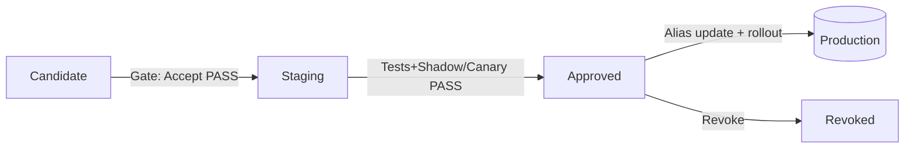

# Z5-2.7 — **Promoção & Change Management**

*“cada passagem de estágio vira uma **mudança controlada**, com evidências, janelas, plano de volta e comunicação”*

---

## 1) Objetivo & Princípios

**Objetivo:** mover versões de modelo entre estados (`Candidate → Staging → Approved → Revoked`) com **controle de mudança** e **rastreabilidade** completa.

**Princípios**

* **Policy-as-Code primeiro** (gates automáticos) + **four-eyes** (dupla aprovação humano-independente).
* **Sem evidência, sem promoção** (assinatura/attestation, SBOM, Model Card, SCDR/ADR, canary).
* **Mudança reversível** (rollback plan e aliases auditáveis).
* **Janela, impacto e comunicação** definidos antes.
* **Trilhas** em Z9 (eventos, decision logs, correlação com incident/change).

---

## 2) Fluxo Padrão de Promoção (visão operacional)



**Passos chave**

1. **Submit → Candidate**: aceite automatizado (Z5-2.2 & 2.3).
2. **Candidate → Staging**: readiness + policy snapshot (provisional) + four-eyes.
3. **Staging → Approved**: **canary**/**shadow** PASS, SLOs ok, *policy snapshot* **definitivo**, four-eyes.
4. **Approved → Produção**: atualizar **alias**/rota, plano de rollout (porcentagens), comunicação.
5. **Revoked** (a qualquer tempo): bloquear consumo, purgar cache, abrir incidente/SCDR.

---

## 3) Tipos de Mudança (ITIL-like)

* **Standard**: pequena, repetível, baixo risco (ex.: troca de alias para versão já Approved).
* **Normal**: requer avaliação + CAB (Produto, Segurança, Operações).
* **Emergency**: risco/impacto alto; **rollback prioritário** ou **revogação** imediata.

Cada promoção cria um **Change Ticket** com: escopo, riscos, impacto, janelas, passos, *backout*, validação pós-mudança, responsáveis.

---

## 4) Artefatos de Release (publicados pela promoção)

* **`release_manifest.json`** (mínimo):

  ```json
  {
    "model": "risk-default",
    "version": "v2.3.0",
    "artifact_digest": "sha256:...",
    "policy_digest": "a1b2...",
    "canary": {"strategy":"5%→25%→100%","window_min":30},
    "rollback": {"to_version":"v2.2.4","alias":"production"},
    "approvals": {"security":"maria.s","product":"raphael.f"},
    "tickets": {"change":"CHG-10234","incidents":[]}
  }
  ```
* **`policy_snapshot/`** assinado (Rego/YAML).
* **`release_notes.md`** (mudanças, riscos, limitações).
* **Links**: Model Card final, SCDR/ADR, SBOM, attestation.

---

## 5) Gates de Promoção (o que cada um exige)

| Gate                      | Momento      | Checks mínimos                                                                                                                      |
| ------------------------- | ------------ | ----------------------------------------------------------------------------------------------------------------------------------- |
| **Promote→Staging**       | pré-Staging  | Assinatura/attestation **válidas**, SBOM **sem CVE bloqueadora**, `security_decision=PASS`, *policy snapshot* **bound**, **SoD** ok |
| **Canary/Shadow**         | Staging      | Latência p95/p99, erro, métricas de qualidade/fairness dentro de SLO; “diferença vs prod” abaixo do limiar                          |
| **Promote→Approved**      | pré-produção | **Canary=PROCEED**, *four-eyes* (Segurança + Produto), `revalidate_by` definido, *guardrails* publicados                            |
| **Startup/Download (Z6)** | deploy       | `stage ∈ {Staging,Approved}`, assinatura/attestation OK, **não revogado**, `policy_digest` bate                                     |

> *Waiver* temporário só via **SCDR** com TTL — gates checam expiração automaticamente.

---

## 6) Planejamento de Rollout & Backout

**Rollout**

* Estratégias: *canary por tráfego* (5%→25%→100%), *por rotas* (clientes beta), *por região*.
* Critérios de avanço/stop: lista objetiva (p.ex., `p95<=120ms`, `error_rate<0.5%`, ΔAUC≤1pp).

**Backout**

* Plano: voltar **alias `production`** à versão anterior Approved, limpar caches do serving e reabrir tráfego.
* Evidências: logs de troca de alias, *startup checks* da Z6, verificação pós-rollback.

---

## 7) Pipeline (exemplo — GitHub Actions/YAML)

```yaml
jobs:
  promote_to_staging:
    steps:
      - run: opa eval -i inputs/accept.json -d policies 'data.registry.accept.allow'
      - run: mlflow models transition --name risk-default --version $V --stage Staging
      - run: curl -X POST $REGISTRY/webhooks/policy-bind -d @policy_snapshot.tar

  canary_shadow_tests:
    steps:
      - run: ./deploy_canary.sh --traffic 5
      - run: ./measure.sh > canary.json
      - run: opa eval -i canary.json -d policies 'data.runtime.canary.proceed'

  promote_to_approved:
    needs: [promote_to_staging, canary_shadow_tests]
    steps:
      - run: opa eval -i inputs/promote.json -d policies 'data.registry.promote.allow'
      - run: ./four_eyes_approval.sh CHG-10234
      - run: mlflow models transition --name risk-default --version $V --stage Approved
      - run: ./publish_release_artifacts.sh

  cutover_production:
    needs: [promote_to_approved]
    steps:
      - run: ./update_alias.sh risk-default $V production
      - run: ./purge_serving_cache.sh
      - run: ./notify.sh --channels "#ops,#risk,#fraud"
```

---

## 8) Comunicação & Observabilidade

* **Antes**: anúncio de janela e impacto (canais internos).
* **Durante**: *live dashboard* (latência, erro, comparativo canary vs prod).
* **Depois**: *post-change validation* + **release notes**.
* **Z9**: eventos `promotion`, `alias_update`, `rollback`, `revocation` com correlação ao **CHG-ID**.

---

## 9) Regras de Janela & Congelamento

* Produção: janelas **fora de picos** e **sem feriados**; *freeze* de fim de mês (ex.: fechamento contábil).
* Mudança **Emergency** fora de janela só com **aprovador executivo** + SCDR curto.

---

## 10) Runbooks (situações comuns)

* **Canary FAIL**: pausar avanço, coletar métricas, abrir *Problem*, manter tráfego na versão anterior, **não promover**.
* **Mismatch de `policy_digest`** no startup: abortar deploy, sincronizar snapshot, reexecutar gate.
* **Incidente/violação LGPD**: **Revogar** versão, purgar cache, bloquear alias, acionar *IR runbook*, registrar SCDR.
* **CVE crítica no SBOM** pós-release: notificar, *hold* em novas promoções, gerar `vX.Y.Z+fix`, repetir canary.

---

## 11) Mapeamento a Frameworks

* **NIST SP 800-53**: SA-10 (processo de aceitação), CM-3/CM-4 (change/config), SI-4 (monitoramento), AU-2/AU-12 (auditoria).
* **NIST SSDF / SLSA**: cadeia de suprimentos; *attestation* nas promoções.
* **NIST AI RMF**: Govern/Manage (decisões rastreáveis, risco residual).
* **ISO/IEC 27001**: A.12 (operações), A.14 (segurança em desenvolvimento).
* **CSA CCM / AICM**: IAM, SEF, LOG, operações de IA (governança/segurança).
* **ITIL Change**: Standard/Normal/Emergency, CAB, backout plan.

---

## 12) Frase pronta (entrevista)

> “Eu trato **promoção de modelos** como **mudança controlada**: gates automáticos (assinatura/attestation/SBOM/Readiness/Canary), **dupla aprovação** e *release artifacts* (manifest, policy snapshot, notas). Produção acontece via **alias** auditável com plano de **rollback**. Qualquer divergência (`policy_digest`, SLO, incidente) **bloqueia/ revoga** a versão e aciona runbook — tudo com eventos no **Z9**.”
