# 🧱 Arquitetura do Lab 01 — DatOps em AWS (Z0–Z3 + Z8/Z9 — Versão Lab)

## 1. Objetivo do Lab

Este laboratório implementa a **pipeline de dados (DatOps)** da plataforma MLOps Security Lab, cobrindo as zonas:

- **Z0–Z3**:
  - Z0 — Fontes de Dados
  - Z1 — Ingestion & Security Gateway
  - Z2 — Data Lake Bruto (Raw)
  - Z3 — Dados Curados & Data Products
- Com controles transversais de:
  - **Z8 — Security & Trust Services (versão “lite” para lab)**
  - **Z9 — Monitoring, Observability & Audit (versão “lite” para lab)**

Em termos práticos, este lab demonstra:

> Como receber dados de fontes externas/Parceiros/Sistemas internos, aplicar validações e controles mínimos de segurança, armazenar dados brutos de forma confiável e transformá-los em dados curados prontos para consumo (e posterior uso pela pipeline de MLOps) **gastando o mínimo possível na AWS**.

> **Nota:** A versão **completa de produção**, com todos os controles de segurança ligados (WAF, GuardDuty, Security Hub, Macie, KMS avançado, Config, SIEM, etc.), está documentada em `architecture-prod.md`. Este arquivo (`architecture-lab.md`) mostra a versão **enxuta** que pode ser rodada em conta pessoal/lab com baixo custo.

---

## 2. Escopo do Lab

### 2.1. Incluído

Este lab **inclui**:

- **Z0 – Fontes de Dados (simuladas)**  
  - Catálogo de fontes (`z0_data_sources.yaml`).
  - Contratos de dados em JSON Schema (`transactions_v1.json`, etc.).
  - Scripts de teste que simulam chamadas HTTP.

- **Z1 – Ingestion & Security Gateway (AWS)**  
  - **API Gateway HTTP API** expondo um endpoint `/ingest/...`.
  - **Lambda de ingestão** realizando:
    - autenticação leve por API Key,
    - validação de schema/contrato,
    - validação de regras básicas de negócio,
    - roteamento para raw ou quarentena.

- **Z2 – Data Lake Bruto (Raw)**  
  - Bucket **S3 Raw** dedicado:
    - criptografado com SSE-S3,
    - versionado,
    - com acesso público bloqueado,
    - políticas de IAM restritas.

- **Z3 – Dados Curados & Data Products**  
  - Bucket **S3 Curated** separado.
  - **Lambda de curadoria/DQ**:
    - lê dados do Raw,
    - aplica regras de qualidade,
    - mascara/anonimiza PII quando aplicável,
    - grava dados em formato adequado (idealmente Parquet).
  - **AWS Glue Data Catalog** (database e tabelas dos datasets curados).
  - **Amazon Athena** para consultar Z3 via SQL.

- **Z8/Z9 “lite” — Segurança & Observabilidade de baixo custo**
  - IAM por função (least privilege).
  - Segredos em **SSM Parameter Store (Standard)** quando necessário.
  - Criptografia em repouso (SSE-S3).
  - **CloudWatch Logs** para API Gateway e Lambdas.
  - **CloudTrail (management events)** ativo na conta (descrito em `hardening/aws-account`).

### 2.2. Fora de escopo (neste lab)

Para controlar custos, **não serão ativados neste lab** (apenas documentados como recomendados para produção):

- AWS WAF
- Amazon GuardDuty
- AWS Security Hub
- Amazon Macie
- KMS com CMKs dedicadas por domínio (SSE-KMS avançado)
- AWS Config + Config Rules
- SIEM/UEBA/SOAR dedicados (Security Lake, OpenSearch, Splunk, etc.)

Os detalhes de como esses controles se encaixam na arquitetura de produção estão em `architecture-prod.md`.  
Aqui, eles são apenas citados na **Seção 7** como “próximos passos” de endurecimento.

---

## 3. Visão de Alto Nível



> **Nota sobre itens “Prod only”**  
> No diagrama abaixo, componentes marcados como **“(Prod only)”** ou conectados por setas tracejadas representam controles recomendados para **ambientes produtivos**, mas **não são implantados neste laboratório** por questões de custo e simplicidade. Eles aparecem aqui apenas para mostrar a arquitetura alvo e manter alinhamento com o `architecture-prod.md`.

### 3.1. Diagrama lógico (Z0–Z3 + Z8/Z9 — Versão Lab)

```mermaid
flowchart LR
    subgraph Z0["Z0 - Fontes de Dados (Simuladas)"]
        ext_app["App Externo (script HTTP)"]
        partner["Parceiro (script HTTP)"]
        int_sys["Sistema Interno (script HTTP)"]
    end

    %% Item de segurança opcional (produção)
    waf["AWS WAF\n(Prod only)"]

    subgraph Z1["Z1 - Ingestion & Security Gateway (AWS)"]
        api_gw["API Gateway (HTTP API)\n/ingest/*"]
        lambda_ing["Lambda - Ingestion & Validation"]
    end

    subgraph Z2["Z2 - Raw Data Lake (Restricted)"]
        s3_raw["S3 Bucket - Raw\nVersionado + SSE-S3\nAcesso restrito"]
        s3_raw_quarantine["S3 Prefix - Quarantine"]
    end

    subgraph Z3["Z3 - Curated Data & Data Products"]
        lambda_cur["Lambda - Curated & DQ"]
        s3_cur["S3 Bucket - Curated"]
        glue["Glue Data Catalog\n(Database/Tables)"]
        athena["Amazon Athena\n(SQL sobre Z3)"]
    end

    subgraph Z8Z9["Z8/Z9 - Segurança & Observabilidade (Lite)"]
        cw_logs["CloudWatch Logs"]
        cw_metrics["CloudWatch Metrics/Alarms"]
        cloudtrail["AWS CloudTrail\n(Management Events)"]

        %% Itens de segurança só-prod (não implementados no lab)
        guardduty["Amazon GuardDuty\n(Prod only)"]
        securityhub["AWS Security Hub\n(Prod only)"]
        macie["Amazon Macie\n(Prod only)"]
        config["AWS Config / Config Rules\n(Prod only)"]
        kms["AWS KMS (CMKs / SSE-KMS)\n(Prod only)"]
        siem["SIEM / Security Lake / SOAR\n(Prod only)"]
    end

    %% Tráfego normal do lab (sem WAF ativo)
    ext_app -->|HTTPS + x-api-key| api_gw
    partner -->|HTTPS + x-api-key| api_gw
    int_sys -->|HTTPS + x-api-key| api_gw

    %% Caminho opcional de produção via WAF (tracejado - Prod only)
    ext_app -.->|Prod only| waf
    partner -.->|Prod only| waf
    int_sys -.->|Prod only| waf
    waf -.->|Prod only| api_gw

    api_gw --> lambda_ing
    lambda_ing -->|válido| s3_raw
    lambda_ing -->|inválido/suspeito| s3_raw_quarantine

    s3_raw -->|event / schedule| lambda_cur
    lambda_cur --> s3_cur
    s3_cur --> glue
    glue --> athena

    lambda_ing --> cw_logs
    lambda_cur --> cw_logs
    api_gw --> cw_logs
    api_gw --> cloudtrail

    %% Ligações opcionais de segurança (prod only) - tracejadas
    cloudtrail -.-> guardduty
    cloudtrail -.-> securityhub

    s3_raw -.-> macie
    s3_cur -.-> macie
    macie -.-> securityhub

    s3_raw -.-> kms
    s3_cur -.-> kms

    cw_logs -.-> siem
    cloudtrail -.-> siem

    %% Estilo para componentes Prod only
    classDef prodOnly fill:#ffffff,stroke:#999,stroke-dasharray: 3 3,color:#666,font-style:italic;
    class waf,guardduty,securityhub,macie,config,kms,siem prodOnly;
````

---

## 4. Componentes por Zona (Versão Lab)

### 4.1. Z0 — Fontes de Dados (Simuladas)

**Objetivo:** registrar e controlar quem produz dados, qual é o contrato, classificação e finalidade, antes de entrar no pipeline.

**Implementação no lab:**

* Arquivo `schemas/z0_data_sources.yaml` contendo:

  * `source_id`: identificador único da fonte (ex.: `ext_app_clientes`, `partner_bureau`).
  * `type`: `external`, `partner` ou `internal`.
  * `description`: descrição de negócio da fonte.
  * `endpoint`: URL de ingestão utilizada.
  * `schema`: nome/versão do JSON Schema associado (ex.: `transactions_v1.json`).
  * `classification`: classificação de dados (`public`, `internal`, `sensitive`, etc.).
  * `purpose`: finalidade (treino, monitoramento, teste, etc.).
* Schemas de dados em JSON: `schemas/transactions_v1.json`, etc.
* Scripts de exemplo em `samples/` ou `tests/` para simular essas fontes via HTTP.

**Riscos endereçados (no escopo do lab):**

* Data poisoning “acidental” (payload fora do esperado).
* Falta de rastreabilidade de “quem mandou o quê” (via `source_id` + API Key).

---

### 4.2. Z1 — Ingestion & Security Gateway (API Gateway + Lambda)

**Objetivo:** ser a única porta de entrada para dados no Data Lake, aplicando autenticação, rate limit, validação de conteúdo/contrato e filtragem inicial de lixo/suspeitos.

> Em produção, esta zona seria protegida por **AWS WAF** (ver `architecture-prod.md`).
> No lab, o WAF **não é criado** para evitar custos fixos.

**Componentes principais (lab):**

* **Amazon API Gateway (HTTP API)**

  * Endpoint principal: `POST /ingest/transactions`
  * Autenticação:

    * Fonte envia `x-api-key`.
    * API Gateway valida a chave antes da Lambda.
  * Proteções:

    * Usage Plans por API Key (rate limit + burst).
    * Mínimo de validação de tamanho de payload (limit Body Size).

* **AWS Lambda `ingestion_lambda`**

  * Etapas principais:

    1. **Identificação da fonte**

       * Lê `x-api-key` e resolve para um `source_id` definido em `z0_data_sources.yaml`.
    2. **Carregamento do contrato**

       * Localiza o JSON Schema associado ao `source_id`.
    3. **Validação de payload (schema + regras de negócio)**

       * JSON bem formado.
       * Campos obrigatórios presentes.
       * Tipos corretos (string, number, date, etc.).
       * Enums (canal, status) dentro da allowlist.
       * Regras simples:

         * `valor > 0`,
         * `data_hora` não muito no futuro, nem anterior a um limite mínimo.
    4. **Roteamento**

       * Se válido → grava no S3 Raw com prefixo `raw/source=...`.
       * Se inválido/suspeito → grava no prefixo `quarantine/source=...` com metadados de erro.
    5. **Logging estruturado**

       * Log em formato JSON com:

         * `request_id`, `source_id`, `schema_version`, `result` (`accepted` / `quarantine`), tamanho do payload, etc.

**Controles de segurança incluídos (lab):**

* Autenticação por API Key (suficiente para lab).
* Rate limiting / quota no API Gateway.
* Validação de schema + regras de negócio dentro da Lambda.
* Logging estruturado em CloudWatch.

---

### 4.3. Z2 — Data Lake Bruto (Raw) em S3

**Objetivo:** armazenar o dado bruto o mais próximo possível da origem, com segurança forte (privado, criptografado, versionado) e trilha básica de auditoria — sem estourar custos.

**Componentes principais (lab):**

* **Bucket S3 Raw** (ex.: `mlops-lab-datops-raw-<suffix>`)

  * Configurações:

    * Block Public Access = ON.
    * Criptografia: **SSE-S3** (S3 gerenciando chaves).
    * Versionamento habilitado.
  * Layout de pastas:

    * Dados válidos:

      * `raw/source=<source_id>/year=<yyyy>/month=<mm>/day=<dd>/...`
    * Dados em quarentena:

      * `quarantine/source=<source_id>/year=<yyyy>/month=<mm>/day=<dd>/...`
  * Metadados:

    * `source_id`, `schema_version`, `ingestion_timestamp`, `validation_result`, etc.

* **IAM (lab):**

  * Lambda `ingestion_lambda`:

    * Permissão apenas para `s3:PutObject` em prefixes `raw/` e `quarantine/` do bucket Raw.
  * Lambda de curadoria:

    * Permissão `s3:GetObject` no bucket Raw + `s3:PutObject` no bucket Curated.

> Em produção, seriam adicionados:
>
> * SSE-KMS com CMKs dedicadas,
> * CloudTrail Data Events e Macie,
> * Config Rules para garantir compliance (ver `architecture-prod.md`).

---

### 4.4. Z3 — Dados Curados & Data Products (S3 + Glue + Athena)

**Objetivo:** fornecer datasets limpos, normalizados, com PII tratada, prontos para consumo analítico e MLOps — mantendo a simplicidade de um lab.

**Componentes principais (lab):**

* **Bucket S3 Curated** (ex.: `mlops-lab-datops-curated-<suffix>`)

  * Configurações semelhantes ao Raw:

    * Block Public Access = ON.
    * Criptografia SSE-S3.
    * Versionamento habilitado.
  * Layout:

    * `curated/domain=<dominio>/dataset=<nome>/year=<yyyy>/month=<mm>/day=<dd>/...`
    * Exemplo:

      * `curated/domain=fraud/dataset=transactions/2025/11/15/part-0001.parquet`

* **Lambda `curated_lambda`**

  * Disparo:

    * via EventBridge Scheduler (ex.: a cada 5 minutos) **ou**
    * via evento de novos objetos no Raw (S3 Event Notification).
  * Responsabilidades:

    1. Ler novos arquivos do Raw (ignorando quarentena).
    2. Aplicar regras de Data Quality:

       * completude mínima,
       * validação de ranges,
       * regras de consistência.
    3. Normalização:

       * padronizar tipos,
       * ajustar formatos de data, moeda, etc.
    4. Privacidade:

       * remover colunas desnecessárias,
       * mascarar/anonimizar identificadores sensíveis.
    5. Escrita:

       * gravar arquivos curados em formato colunar (preferencialmente Parquet).

* **AWS Glue Data Catalog**

  * Database dedicado para o lab (ex.: `mlops_lab_datops`).
  * Tabelas:

    * `fraud_transactions_curated` apontando para o prefixo `curated/domain=fraud/dataset=transactions/...`.

* **Amazon Athena**

  * Consultas SQL sobre as tabelas do Glue:

    * validação da pipeline,
    * exploração dos dados,
    * base para o lab 02 (MLOps).

---

### 4.5. Z8 “Lite” — Security & Trust Services

**Objetivo:** representar o papel da Z8 (IAM, segredos, criptografia, governança) de forma simples e barata, adequada a um lab pessoal.

**Controles incluídos (lab):**

1. **IAM com privilégio mínimo**

   * Roles dedicadas:

     * `mlops-datops-lambda-ingestion-role`
     * `mlops-datops-lambda-curation-role`
   * Policies:

     * S3 apenas nos buckets/prefixos necessários.
     * CloudWatch Logs apenas para criar/gravar logs dos próprios Lambdas.

2. **Segredos no SSM Parameter Store (Standard)**

   * Armazenamento de:

     * API keys simuladas (quando não gerenciadas diretamente no API Gateway),
     * outros segredos simples.
   * Nunca guardar segredos em código ou versionamento.

3. **Criptografia padrão (SSE-S3)**

   * Todos os buckets (Raw/Curated) com SSE-S3 ativado.
   * Evolução futura para SSE-KMS/CMK documentada como melhoria (Seção 7.5 de produção).

> Em produção, esta camada seria expandida com:
>
> * Secrets Manager,
> * KMS com CMKs dedicadas,
> * WAF, GuardDuty, Security Hub, Macie, Config, etc.
>   Tudo isso está detalhado em `architecture-prod.md`.

---

### 4.6. Z9 “Lite” — Observabilidade & Auditoria

**Objetivo:** fornecer observabilidade mínima da pipeline (DatOps) com foco em custo baixo.

**Controles incluídos (lab):**

1. **CloudWatch Logs**

   * Habilitado para:

     * Lambda ingestion,
     * Lambda curadoria,
     * API Gateway (access logs).
   * Padrão de log estruturado em JSON nas Lambdas:

     * `trace_id`/`request_id`,
     * `source_id`,
     * `result` (`accepted` / `quarantine`),
     * `dataset`, `error_type`, etc.

2. **Métricas e alarmes básicos em CloudWatch**

   * Métricas:

     * Erros 4xx/5xx de API Gateway.
     * Invocações e erros das Lambdas.
   * Alarmes:

     * disparo por e-mail (ou SNS) quando erros passam de um limite definido.

3. **CloudTrail (eventos de gerenciamento)**

   * Habilitado na conta (conforme `hardening/aws-account`).
   * Usado para auditar:

     * alterações de IAM,
     * criação/alteração de buckets,
     * deploy de Lambdas, etc.

> Em produção, esta camada seria expandida com:
>
> * CloudTrail Data Events,
> * Security Lake / SIEM,
> * integração profunda com Security Hub, GuardDuty, WAF, etc. (ver `architecture-prod.md`).

---

## 5. Fluxos Principais (Lab)

### 5.1. Fluxo F1 — Ingestão Válida (Z0 → Z1 → Z2)

1. A fonte (script ou sistema) envia `POST /ingest/transactions` com:

   * `x-api-key` válida,
   * payload JSON conforme contrato (`transactions_v1.json`).
2. API Gateway:

   * valida API Key,
   * aplica rate limiting/quota,
   * encaminha requisição para `ingestion_lambda`.
3. Lambda:

   * resolve `source_id` a partir da API Key.
   * carrega JSON Schema correto.
   * valida payload (schema + regras).
   * grava objeto em `s3://raw/source=<source_id>/...` com metadados.
   * registra log de sucesso em CloudWatch.
4. Dados ficam disponíveis na Z2 para curadoria posterior.

### 5.2. Fluxo F2 — Ingestão Inválida / Quarentena

1. A fonte envia requisição com payload inválido (schema incorreto, regras de negócio violadas, etc.).
2. API Gateway aceita a requisição (do ponto de vista de HTTP), mas:

   * Lambda detecta falha na validação.
3. Lambda:

   * registra detalhes do erro nos logs.
   * grava o objeto em `s3://raw/quarantine/source=<source_id>/...`,

     * incluindo metadados `validation_error_type`, `validation_error_details`.
   * retorna um HTTP 400 (ou status apropriado) para o cliente com mensagem genérica.
4. Métricas de “registros em quarentena” podem ser usadas em CloudWatch para criar alarmes.

### 5.3. Fluxo F3 — Curadoria e Publicação em Z3

1. `curated_lambda` é acionada:

   * por agendamento (EventBridge) ou
   * por eventos de novos objetos na Z2.
2. Lambda:

   * lista novos arquivos válidos no Raw.
   * aplica regras de DQ e normalização.
   * aplica mascaramento/anonimização conforme necessário.
   * grava arquivos Parquet em `s3://curated/domain=.../dataset=.../year=.../`.
   * registra logs de quantos registros foram aceitos, descartados, etc.
3. Glue:

   * possui tabelas apontando para esses paths.
4. Athena:

   * usuários/testes podem consultar os dados curados para verificar o pipeline.

---

## 6. Resumo dos Controles de Segurança Implementados (Lab)

Nesta versão do lab, os seguintes controles são **efetivamente implementados**:

* **Z0**

  * Catálogo de fontes e contratos de dados (YAML + JSON Schema).

* **Z1**

  * API Gateway com:

    * API Key por fonte,
    * Usage Plans (rate limit / quota).
  * Lambda com:

    * validação de schema,
    * validação de regras de negócio,
    * roteamento raw vs quarentena,
    * logging estruturado.

* **Z2**

  * S3 Raw:

    * privado,
    * SSE-S3,
    * versionado,
    * layout raw/quarentena por fonte.

* **Z3**

  * S3 Curated:

    * privado,
    * SSE-S3,
    * versionado.
  * Lambda Curadoria:

    * DQ básica,
    * normalização,
    * mascaramento PII.
  * Glue Catalog + Athena para consumo seguro.

* **Z8 (lite)**

  * IAM com privilégio mínimo por Lambda.
  * Segredos no SSM Parameter Store (Standard).
  * Criptografia SSE-S3.

* **Z9 (lite)**

  * CloudWatch Logs para API Gateway e Lambdas.
  * Métricas e alarmes básicos.
  * CloudTrail para eventos de gerenciamento.

> Para ver como essa arquitetura evolui para uma **versão de produção completa**, com WAF, GuardDuty, Security Hub, Macie, KMS com CMKs dedicadas, Config Rules e SIEM/Security Lake, consulte `architecture-prod.md`.

---

## 7. Controles Recomendados para Produção (Não Incluídos no Lab)

Nesta versão de lab, os controles abaixo são **somente documentados**, mas não ativados, para manter o custo baixo:

* **7.1. AWS WAF (Web Application Firewall)**
* **7.2. Amazon GuardDuty**
* **7.3. AWS Security Hub**
* **7.4. Amazon Macie**
* **7.5. KMS com CMKs dedicadas (SSE-KMS avançado)**
* **7.6. AWS Config + Config Rules**
* **7.7. SIEM / UEBA / SOAR (ou Security Lake / Detective)**

Os detalhes completos de cada um (ponto no fluxo, função, justificativa de custo e integração com o restante do ambiente) são descritos em `architecture-prod.md`.

---

## 8. Próximos Passos

* Criar e versionar os arquivos:

  * `schemas/z0_data_sources.yaml`
  * `schemas/transactions_v1.json`
* Implementar:

  * `terraform/` para API Gateway, Lambdas, S3 Raw/Curated, Glue/Athena.
  * `src/ingestion_lambda/app.py` e `src/curated_lambda/app.py`.
* Alinhar este documento com:

  * `labs/01-datops-aws/README.md` (visão de uso),
  * `labs/01-datops-aws/SECURITY.md` (foco em ameaças/controles),
  * `hardening/aws-account/` (baseline da conta onde o lab roda),
  * `architecture-prod.md` (visão de produção).

Este `architecture-lab.md` descreve **como o lab deve ser implementado em uma conta de baixo custo**, servindo como ponte entre o conceito DatOps e a futura arquitetura de produção (`architecture-prod.md`), onde os controles de segurança são aplicados em sua totalidade.
