# 🧱 Arquitetura do Lab 01 — DatOps em AWS (Z0–Z3 + Z8/Z9 — Versão Ambiente Produtivo)

## 1. Objetivo da Arquitetura de Produção

Esta arquitetura descreve a **versão de produção** da pipeline de dados (DatOps) da plataforma **MLOps Security Lab**, cobrindo as zonas:

- **Z0–Z3**:
  - Z0 — Fontes de Dados
  - Z1 — Ingestion & Security Gateway
  - Z2 — Data Lake Bruto (Raw)
  - Z3 — Dados Curados & Data Products
- Com controles transversais de:
  - **Z8 — Security & Trust Services (completa para produção)**
  - **Z9 — Monitoring, Observability & Audit (completa para produção)**

Foco:

> Garantir que o fluxo Z0–Z3 opere com **segurança, observabilidade, resiliência e compliance**, incluindo WAF, detecção gerenciada de ameaças, proteção de dados sensíveis, criptografia com KMS, governança contínua de configuração e integração com SIEM/Security Lake.

Esta arquitetura complementa o documento `architecture-lab.md`, que é focado em **baixo custo** e **setup mínimo**.

---

## 2. Escopo da Arquitetura de Produção

### 2.1. Incluído

Na versão de produção, estão incluídos:

- **Z0 – Fontes de Dados (produtivas)**  
  - Fontes externas, parceiros e sistemas internos reais.
  - Catálogo formal de fontes (`z0_data_sources.yaml` ou repositório equivalente).
  - Contratos de dados em JSON Schema / Avro / Protobuf.

- **Z1 – Ingestion & Security Gateway (AWS)**  
  - **API Gateway (HTTP ou REST API, endpoint REGIONAL)** expondo `/ingest/...`.
  - **AWS WAF** protegendo o endpoint de ingestão (direto no API Gateway REST API ou via CloudFront + WAF para HTTP API).
  - **Lambda de ingestão** com autenticação, validação de schema e regras de negócio.
  - Rate limiting/quota por cliente/parceiro.

- **Z2 – Data Lake Bruto (Raw)**  
  - Bucket **S3 Raw** dedicado:
    - criptografia com **SSE-KMS (CMK dedicada)**,
    - versionamento,
    - acesso público bloqueado,
    - policies de IAM restritivas,
    - CloudTrail Data Events habilitados.

- **Z3 – Dados Curados & Data Products**  
  - Bucket **S3 Curated** com SSE-KMS.
  - **Lambda de curadoria/DQ** para qualidade de dados, normalização e mascaramento/anomização de PII.
  - **AWS Glue Data Catalog** (database/tabelas).
  - **Amazon Athena** para consultas analíticas.
  - Integração opcional com **AWS Lake Formation** para controle fino de acesso.

- **Z8 – Security & Trust Services (full)**  
  - IAM com privilégio mínimo e roles dedicadas por função.
  - Segredos em **AWS Secrets Manager** e/ou **SSM Parameter Store (SecureString)**.
  - **AWS KMS** com CMKs dedicadas (por domínio ou por classificação).
  - **AWS WAF** (Web ACLs com regras gerenciadas e customizadas).
  - **Amazon GuardDuty**.
  - **AWS Security Hub**.
  - **Amazon Macie**.
  - **AWS Config + Config Rules**.

- **Z9 – Monitoring, Observability & Audit (full)**  
  - **CloudWatch Logs** (API Gateway, Lambdas, WAF, etc.).
  - **CloudWatch Metrics & Alarms**.
  - **AWS X-Ray** (opcional para tracing fim-a-fim).
  - **CloudTrail** (Management + Data Events).
  - Integração com **Amazon Security Lake** ou SIEM externo (Splunk/Elastic/etc.).
  - Painéis de observabilidade e relatórios de auditoria.

### 2.2. Fora de Escopo (neste documento)

- Detalhes da **organização multi-conta** (Landing Zone, AWS Organizations) – assumido como pré-existente.
- Estratégias multi-região (active-active) e DR completo – podem ser tratados em documento separado de **Arquitetura de Resiliência**.
- Ferramentas de DLP e CASB de terceiros (Zscaler, Netskope, etc.) – podem complementar, mas não são centrais ao fluxo Z0–Z3.

---

## 3. Visão de Alto Nível



### 3.1. Diagrama lógico (Z0–Z3 + Z8/Z9 em Produção)

> **Nota de implementação do WAF**  
> - Se o gateway for **REST API**, o WAF pode ser associado **diretamente** ao stage (WAFv2 REGIONAL).  
> - Se o gateway for **HTTP API**, recomenda-se **CloudFront + WAF (Global Web ACL)**.  
> No diagrama abaixo, o WAF é representado conceitualmente à frente do API Gateway.

```mermaid
flowchart LR
    subgraph Z0["Z0 - Fontes de Dados (Prod)"]
        ext_app["App Externo (Mobile/Web)"]
        partner["Parceiro / Terceiro"]
        int_sys["Sistema Interno\n(Core/Backoffice)"]
    end

    %% Camada de proteção de borda
    waf["AWS WAF\n(Web ACL - OWASP + Custom Rules)"]

    subgraph Z1["Z1 - Ingestion & Security Gateway (AWS)"]
        api_gw["API Gateway (HTTP/REST API)\n/ingest/*"]
        lambda_ing["Lambda - Ingestion & Validation"]
    end

    subgraph Z2["Z2 - Raw Data Lake (Restricted)"]
        s3_raw["S3 Bucket - Raw\nSSE-KMS (CMK)\nVersionado + Privado"]
        s3_raw_quarantine["S3 Prefix - Quarantine\nDados inválidos/suspeitos"]
    end

    subgraph Z3["Z3 - Curated Data & Data Products"]
        lambda_cur["Lambda - Curated & DQ"]
        s3_cur["S3 Bucket - Curated\nSSE-KMS (CMK)"]
        glue["Glue Data Catalog\n(Database/Tables)"]
        athena["Amazon Athena\n(SQL sobre Z3)"]
    end

    subgraph Z8Z9["Z8/Z9 - Segurança, Monitoramento & Auditoria"]
        kms["AWS KMS (CMKs dedicadas)"]
        secrets["Secrets Manager / SSM\n(Segredos & Configs)"]
        cw_logs["CloudWatch Logs"]
        cw_metrics["CloudWatch Metrics & Alarms"]
        cloudtrail["AWS CloudTrail\n(Management + Data Events)"]
        guardduty["Amazon GuardDuty"]
        securityhub["AWS Security Hub"]
        macie["Amazon Macie"]
        config["AWS Config + Config Rules"]
        securitylake["Amazon Security Lake / SIEM"]
    end

    %% Tráfego de produção - sempre atrás do WAF
    ext_app -->|HTTPS| waf
    partner -->|HTTPS| waf
    int_sys -->|HTTPS| waf
    waf --> api_gw

    api_gw --> lambda_ing
    lambda_ing -->|válido| s3_raw
    lambda_ing -->|inválido/suspeito| s3_raw_quarantine

    s3_raw -->|event / schedule| lambda_cur
    lambda_cur --> s3_cur
    s3_cur --> glue
    glue --> athena

    %% Logs & eventos para Z8/Z9
    lambda_ing --> cw_logs
    lambda_cur --> cw_logs
    api_gw --> cw_logs
    waf --> cw_logs

    api_gw --> cw_metrics
    lambda_ing --> cw_metrics
    lambda_cur --> cw_metrics

    %% Auditoria & detecção
    cloudtrail --> guardduty
    cloudtrail --> securityhub
    cw_logs --> securityhub

    s3_raw --> macie
    s3_cur --> macie
    macie --> securityhub

    s3_raw --> kms
    s3_cur --> kms

    %% Governança de configuração
    s3_raw --> config
    s3_cur --> config
    api_gw --> config
    config --> securityhub

    %% Centralização em SIEM/Security Lake
    cw_logs --> securitylake
    cloudtrail --> securitylake
    guardduty --> securitylake
    securityhub --> securitylake
````

---

## 4. Componentes por Zona (Produção)

### 4.1. Z0 — Fontes de Dados (Produção)

**Objetivo:** controlar quem envia dados, com qual contrato, classificação e finalidade, garantindo governança de entrada.

**Implementação típica em produção:**

* **Catálogo de fontes** (repositório Git / CMDB / Data Catalog):

  * `source_id`, `owner`, `type` (`external`, `partner`, `internal`).
  * `contract_version` (JSON Schema/Avro/Protobuf).
  * `data_classification` (`public`, `internal`, `sensitive`, `restricted`).
  * `purpose` (operacional, analítico, treino, monitoramento, etc.).
  * `legal_basis` / base legal (LGPD/GDPR quando aplicável).

* **Contratos de dados**:

  * JSON Schema versionado por dataset.
  * Opcional: registro em Glue/Data Catalog ou Service Catalog de dados.

* **Integração com segurança**:

  * Mapeamento entre `source_id` ↔ API Key / Client ID / Tenant.
  * Fontes com dado sensível anotadas para regras específicas (ex.: enriquecimento de Macie, KMS, retenção).

**Riscos endereçados:**

* Data poisoning (entrada de dados fora do contrato).
* Entrada de PII onde não deveria existir.
* Falta de rastreabilidade entre “quem enviou” e “que dados chegaram”.

---

### 4.2. Z1 — Ingestion & Security Gateway (WAF + API Gateway + Lambda)

**Objetivo:** ser a **única porta de entrada** para dados no Data Lake, combinando segurança de borda, controle de acesso, validação de conteúdo e proteção contra ataques comuns.

#### 4.2.1. AWS WAF

* **Posição no fluxo:**

  * à frente do API Gateway:

    * REST API → Web ACL Regional associada ao Stage; ou
    * HTTP API → CloudFront + Web ACL Global, com API Gateway como origin.
* **Regras típicas:**

  * Managed Rules (AWS / AWS-AWSManagedRulesCommonRuleSet / SQLi / LFI/RFI etc.).
  * Regras customizadas:

    * Rate limiting por IP / chave / path.
    * Bloqueio por geolocalização.
    * Allowlist/denylist de IPs/ASN.
* **Integração com monitoramento:**

  * Logs do WAF enviados para CloudWatch Logs e/ou S3 + Security Lake.
  * Métricas de bloqueios, desafios (CAPTCHA/Challenge) e false positives.

#### 4.2.2. API Gateway (HTTP/REST API)

* **Responsabilidades:**

  * Terminação de TLS.
  * Autenticação/autorização primária (API Keys, JWT, Cognito, mTLS, etc.).
  * Rate limiting & quotas (usage plans).
  * Enriquecimento de contexto (headers, stage variables).

* **Configurações recomendadas em produção:**

  * Endpoints do tipo **REGIONAL**.
  * TLS 1.2+ apenas.
  * Request/response logs habilitados (com cuidado com dados sensíveis).
  * Tamanho máximo de payload controlado.

#### 4.2.3. Lambda `ingestion_lambda`

* **Fluxo principal:**

  1. Resolver `source_id` a partir de API Key / Client ID / claims do JWT.
  2. Carregar o contrato de dados (schema).
  3. Validar:

     * estrutura (schema),
     * tipos,
     * enums (allowlists),
     * regras de negócio básicas.
  4. Roteamento:

     * cargas válidas → `s3://raw/source=...`
     * cargas inválidas/suspeitas → `s3://raw/quarantine/source=...`
  5. Logar evento estruturado (JSON) com `source_id`, `schema_version`, resultado, erro, etc.

* **Segurança:**

  * Role IAM dedicada apenas com:

    * `s3:PutObject` nos prefixes de Raw/Quarantine.
    * `ssm:GetParameter` / `secretsmanager:GetSecretValue` conforme necessário.
  * Sem segredos em variáveis de ambiente em texto puro.
  * Dependências gerenciadas via pipeline (scan SCA, assinatura, etc.).

---

### 4.3. Z2 — Data Lake Bruto (Raw) em S3

**Objetivo:** armazenar **dado bruto imutável** com segurança forte e alta auditabilidade.

**Componentes principais (produção):**

* **Bucket S3 Raw (prod)**

  * `mlops-prod-datops-raw-<suffix>`
  * Configurações:

    * Block Public Access = ON.
    * **SSE-KMS** com CMK dedicada àquele domínio/ambiente.
    * Versionamento habilitado.
    * Logging de acesso S3 ativado (para auditoria).
    * CloudTrail Data Events para `GetObject`/`PutObject`.

* **Layout de pastas:**

  * Dados válidos:

    * `raw/source=<source_id>/year=<yyyy>/month=<mm>/day=<dd>/...`
  * Quarentena:

    * `quarantine/source=<source_id>/year=<yyyy>/month=<mm>/day=<dd>/...`

* **Integração com Macie:**

  * Macie configurado para:

    * varrer buckets Raw (por escopo de classificação).
    * identificar PII/credenciais acidentalmente armazenadas.
    * gerar findings para Security Hub.

* **Config Rules:**

  * Regras para garantir:

    * bucket nunca público;
    * criptografia sempre habilitada (KMS);
    * logging ativo.

**Riscos endereçados:**

* Vazamento acidental de dados via configuração incorreta de bucket.
* Modificação silenciosa de dados (versionamento + trilha).
* Armazenamento de PII/segredos sem visibilidade (Macie).

---

### 4.4. Z3 — Dados Curados & Data Products

**Objetivo:** publicar dados limpos, normalizados, **com PII tratada e acesso controlado**, prontos para consumo analítico e MLOps.

**Componentes principais:**

* **Bucket S3 Curated (prod)**

  * SSE-KMS com CMK dedicada (diferente ou segmentada por domínio).
  * Versionamento + logging + CloudTrail Data Events.
  * Layout:

    * `curated/domain=<dominio>/dataset=<nome>/year=<yyyy>/month=<mm>/day=<dd>/...`

* **Lambda `curated_lambda`**

  * Orquestrada via EventBridge ou Step Functions (em fluxos mais complexos).
  * Responsabilidades:

    * ler dados do Raw;
    * aplicar regras de Data Quality;
    * remover/mascarar PII;
    * gravar em formato colunar (Parquet).

* **Glue Data Catalog + Athena**

  * Database `mlops_prod_datops`.
  * Tabelas alinhadas com o modelo de dados de negócio.
  * Integração opcional com **Lake Formation** para:

    * controle de acesso a nível de tabela, coluna e linha;
    * aplicação de políticas baseadas em atributos (ABAC).

* **Macie em Z3:**

  * valida se dados curados não reintroduzem PII fora das áreas autorizadas.

---

### 4.5. Z8 — Security & Trust Services (Full)

**Objetivo:** prover um conjunto completo de serviços de segurança para **proteção, governança e compliance** da pipeline de dados.

**Principais componentes:**

1. **IAM & Controle de Acesso**

   * Roles separadas por função:

     * ingestão, curadoria, consulta, operações, segurança.
   * Policies com princípio de **least privilege**.
   * Uso de grupos e/ou identity center (SSO) para times.

2. **Gerenciamento de Segredos**

   * **AWS Secrets Manager** / **SSM Parameter Store (SecureString)** para:

     * credenciais de bancos/aplicações;
     * chaves de API de parceiros;
     * tokens JWT de serviços internos.
   * Rotação automática de segredos críticos.

3. **Criptografia com KMS (CMKs)**

   * CMKs distintas por domínio ou criticidade:

     * `cmk-datalake-raw`, `cmk-datalake-curated`, etc.
   * Políticas de key que restringem:

     * quem pode usar a chave;
     * de onde (VPC endpoints, contas, etc.).
   * Logs de uso de chaves via CloudTrail.

4. **AWS WAF**

   * Web ACL com:

     * managed rules (OWASP),
     * regras customizadas por parceiro/endpoint,
     * rate-based rules.
   * Integração com Security Hub via findings.

5. **Amazon GuardDuty**

   * Habilitado na conta/organização.
   * Analisa:

     * CloudTrail,
     * VPC Flow Logs,
     * DNS Logs.
   * Gera alerts de atividades suspeitas/comprometimento.

6. **AWS Security Hub**

   * Agregador central de findings de:

     * GuardDuty, Macie, Config, WAF, Inspector, etc.
   * Usa padrões como AWS Foundational Security Best Practices, CIS, etc.
   * Integra com SIEM/SOAR para resposta automatizada.

7. **Amazon Macie**

   * Scans recorrentes nos buckets Raw/Curated.
   * Classificação de PII / dados sensíveis.
   * Findings enviados para Security Hub.

8. **AWS Config + Config Rules**

   * Conjunto de regras para:

     * S3 sem criptografia → não conforme;
     * buckets públicos → não conforme;
     * CloudTrail desabilitado → não conforme;
     * KMS sem rotação → não conforme.
   * Integração com Security Hub e remediação automática (quando possível).

---

### 4.6. Z9 — Monitoring, Observability & Audit (Full)

**Objetivo:** garantir que o ambiente seja **observável, auditável e monitorado**, com capacidade de detecção precoce e forense.

**Componentes principais:**

1. **CloudWatch Logs & Metrics**

   * Logs:

     * API Gateway (access logs + execution logs);
     * Lambdas (ingest/curated);
     * WAF;
     * outros componentes relevantes.
   * Métricas:

     * latência, erros 4xx/5xx, timeouts;
     * quantidade de registros em quarentena;
     * volume de dados processados.
   * Alarmes:

     * thresholds de erro;
     * picos de tráfego inesperados;
     * aumento de bloqueios no WAF.

2. **X-Ray (opcional)**

   * Traces distribuídos para identificar gargalos.
   * Útil se a pipeline de ingestão for composta por múltiplos serviços.

3. **CloudTrail (Management + Data Events)**

   * Eventos de gerenciamento em toda a conta.
   * Data Events para:

     * buckets Raw/Curated;
     * API Gateway invocations (quando aplicável).

4. **Amazon Security Lake / SIEM Externo**

   * Centralização de:

     * CloudTrail,
     * CloudWatch Logs,
     * findings do Security Hub,
     * WAF logs,
     * VPC Flow Logs.
   * Possibilita correlação de eventos, hunting e relatórios avançados.

5. **Playbooks de Resposta**

   * Opcional, mas recomendado:

     * uso de EventBridge + Lambda / SOAR para:

       * isolar chaves comprometidas;
       * revogar credenciais;
       * notificar squads responsáveis.

---

## 5. Fluxos Principais em Produção

### 5.1. Fluxo F1 — Ingestão Válida (Z0 → Z1 → Z2)

1. Fonte (app, parceiro, sistema interno) envia `POST /ingest/transactions`:

   * via HTTPS, atrás de WAF.
   * com autenticação forte (API Key, JWT, mTLS, etc.).
2. WAF:

   * avalia requisição contra managed/custom rules.
   * bloqueia ataques comuns (SQLi, XSS, etc.).
3. API Gateway:

   * valida identidade (chave/token).
   * aplica rate limiting/quota.
   * encaminha para `ingestion_lambda`.
4. Lambda:

   * resolve `source_id` via contexto.
   * valida contrato de dados.
   * grava em `s3://raw/source=...` com SSE-KMS.
   * registra logs estruturados.
5. CloudWatch / CloudTrail / GuardDuty / Security Hub:

   * registram e correlacionam eventos de ingestão.

### 5.2. Fluxo F2 — Ingestão Inválida / Quarentena

1. Requisição passa pelo WAF (não é ataque, mas payload ruim).
2. API Gateway encaminha para Lambda.
3. Lambda detecta:

   * violação de schema,
   * regra de negócio quebrada,
   * valores fora de range.
4. Lambda grava dado em:

   * `s3://raw/quarantine/source=...`,
   * com `validation_error_type` e detalhes.
5. Logs em CloudWatch e métricas específicas geram:

   * alarmes se volume de quarentena subir demais.

### 5.3. Fluxo F3 — Curadoria e Publicação em Z3

1. `curated_lambda` é disparada:

   * por EventBridge ou S3 Events.
2. Lambda:

   * lê dados válidos no Raw;
   * aplica DQ e limpeza;
   * mascara/anonimiza PII;
   * grava Parquet em `s3://curated/domain=...`.
3. Glue + Athena:

   * disponibilizam tabelas para consumo.
4. Lake Formation (se usado):

   * controla quem pode ver quais colunas/linhas.

### 5.4. Fluxo F4 — Segurança, Detecção e Auditoria

1. **CloudTrail** registra:

   * criação/alteração de buckets, políticas, chaves KMS, etc.
2. **GuardDuty**:

   * analisa eventos e gera findings de comportamento suspeito.
3. **Macie**:

   * escaneia S3 Raw/Curated e gera findings de PII.
4. **Config Rules**:

   * detectam configurações não conformes.
5. **Security Hub**:

   * consolida findings de todos os serviços.
6. **Security Lake / SIEM**:

   * agrega logs e findings para correlação avançada.
7. Playbooks de resposta:

   * podem automatizar ações (bloquear IPs, revogar credenciais, abrir incident tickets, etc.).

---

## 6. Resumo dos Controles de Segurança Implementados em Produção

Em produção, a pipeline DatOps conta com:

* **Borda & Ingestão**

  * AWS WAF (managed + custom rules).
  * API Gateway com autenticação forte, quotas e rate limit.
  * Lambda de ingestão validando contratos de dados.

* **Armazenamento de Dados**

  * S3 Raw & Curated com:

    * SSE-KMS (CMKs dedicadas).
    * versionamento.
    * logging + CloudTrail Data Events.
  * Macie monitorando PII.

* **Governança & Criptografia**

  * IAM com privilégio mínimo, roles por função.
  * Segredos em Secrets Manager / SSM.
  * KMS com políticas rígidas e logs de uso.

* **Monitoramento & Detecção**

  * CloudWatch Logs/Metrics/Alarms.
  * CloudTrail (Management + Data Events).
  * GuardDuty, Security Hub, Config, Macie.
  * Integração com Security Lake / SIEM externo.

Esta arquitetura `architecture-prod.md` define o **alvo de segurança** para ambientes produtivos da pipeline DatOps.
O documento `architecture-lab.md` pode ser visto como um **subconjunto de baixo custo** desta mesma visão.

---

## 7. Próximos Passos

* Implementar esta arquitetura via **IaC** (Terraform/CDK/CloudFormation).
* Definir **ADR** (Architecture Decision Records) para:

  * escolha de HTTP vs REST API;
  * uso de CloudFront + WAF vs WAF direto no API Gateway;
  * granularidade das CMKs.
* Alinhar esta visão com:

  * `SECURITY.md` (ameaças, controles, mapeamento para frameworks);
  * `RUNBOOK.md` (operações, incident response e troubleshooting);
  * diagramas Z0–Z9 globais da plataforma MLOps Security Lab.
